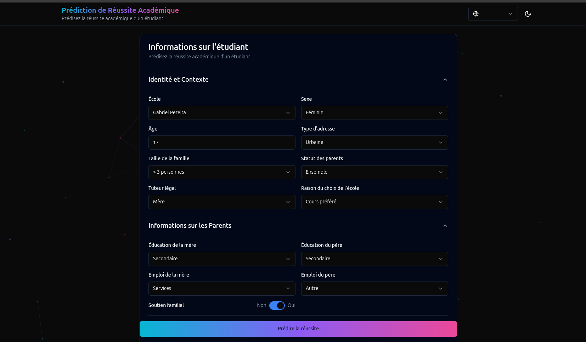

# 🎓 Student Success Predictor - Frontend

Interface web moderne pour prédire la réussite académique des étudiants à l'aide d'un modèle de Machine Learning.



## 🌐 Application en Ligne

**🚀 Application déployée** : [https://student-ml-frontend.vercel.app/](https://student-ml-frontend.vercel.app/)

**🔌 Backend API** : [https://student-ml-backend.onrender.com/](https://student-ml-backend.onrender.com/)

## ✨ Fonctionnalités

- 🎨 **Interface moderne** avec Tailwind CSS et shadcn/ui
- 🌓 **Mode Dark/Light** avec basculement automatique et persistance
- 🌍 **Multilingue** : Français, English, العربية (avec support RTL)
- 📱 **Design responsive** optimisé mobile, tablette et desktop
- 🎭 **Animations fluides** avec Framer Motion
- ⚡ **Particules animées** en arrière-plan (tsparticles)
- 📊 **Résultats détaillés** avec probabilités et recommandations
- 🔔 **Notifications toast** pour les erreurs et succès
- ✅ **Validation** des données en temps réel
- 🎯 **32 variables** pour une prédiction précise

## 🛠️ Stack Technique

- **Framework**: React 18 + TypeScript
- **Build Tool**: Vite 5
- **Styling**: Tailwind CSS 3
- **UI Components**: shadcn/ui (Radix UI)
- **Animations**: Framer Motion
- **Particles**: tsparticles
- **i18n**: react-i18next
- **HTTP Client**: Axios
- **Icons**: Lucide React
- **Déploiement**: Vercel

## 📋 Prérequis

- Node.js >= 18.x
- npm ou yarn

## 🔧 Installation Locale

### 1. Cloner le projet
```bash
git clone https://github.com/abdrahman22053/Predict_student-s_academic_frontend.git
cd Predict_student-s_academic_frontend
```

### 2. Installer les dépendances
```bash
npm install
```

### 3. Configurer les variables d'environnement

Créer un fichier `.env` :
```env
VITE_API_BASE_URL=http://127.0.0.1:8000
```

Pour utiliser l'API en production :
```env
VITE_API_BASE_URL=https://student-ml-backend.onrender.com
```

## 🚀 Développement

**Lancer le serveur de développement**
```bash
npm run dev
```

L'application sera disponible sur `http://localhost:5173`

## 🏗️ Build pour Production

**Compiler le projet**
```bash
npm run build
```

Les fichiers compilés seront dans le dossier `dist/`

**Prévisualiser le build de production**
```bash
npm run preview
```

## 🌐 Déploiement sur Vercel

### Déploiement Automatique

1. **Fork le projet** sur GitHub
2. **Connecter à Vercel** : [vercel.com](https://vercel.com)
3. **Importer le projet** depuis GitHub
4. **Configurer** :
   - **Framework Preset** : Vite
   - **Root Directory** : `front`
   - **Build Command** : `npm run build`
   - **Output Directory** : `dist`
5. **Ajouter la variable d'environnement** :
   - `VITE_API_BASE_URL` = `https://student-ml-backend.onrender.com`
6. **Déployer** 🚀

### Déploiement via CLI

```bash
npm install -g vercel
vercel login
vercel --prod
```

## 📁 Structure du Projet

```
front/
├── public/              # Fichiers statiques
│   └── favicon.svg      # Icône de l'application
├── src/
│   ├── components/      # Composants React
│   │   ├── ui/          # shadcn/ui (12 composants)
│   │   ├── layout/      # Header, AppShell
│   │   ├── forms/       # StudentForm (formulaire principal)
│   │   ├── results/     # ResultCard (affichage résultats)
│   │   └── background/  # ParticlesBackground
│   ├── hooks/           # Hooks personnalisés
│   │   ├── useTheme.ts  # Gestion dark/light mode
│   │   └── useLocale.ts # Gestion i18n et RTL
│   ├── lib/             # Utilitaires
│   │   ├── api.ts       # Client API
│   │   ├── i18n.ts      # Configuration i18next
│   │   └── utils.ts     # Fonctions utilitaires
│   ├── locales/         # Traductions
│   │   ├── fr.json      # Français
│   │   ├── en.json      # English
│   │   └── ar.json      # العربية
│   ├── types/           # Types TypeScript
│   │   └── student.ts   # Types pour les données étudiant
│   ├── styles/          # Styles globaux
│   │   └── globals.css  # CSS avec variables Tailwind
│   ├── App.tsx          # Composant principal
│   ├── main.tsx         # Point d'entrée
│   └── vite-env.d.ts    # Types Vite
├── index.html
├── package.json
├── vite.config.ts
├── tailwind.config.ts
├── tsconfig.json
└── vercel.json          # Configuration Vercel
```

## 🌐 Langues Supportées

| Langue | Code | Support RTL |
|--------|------|-------------|
| 🇫🇷 Français | `fr` | Non |
| 🇬🇧 English | `en` | Non |
| 🇸🇦 العربية | `ar` | ✅ Oui |

Le changement de langue se fait via le sélecteur 🌍 dans l'en-tête.

## 🎨 Thèmes

- **☀️ Light Mode** : Fond clair avec texte sombre
- **🌙 Dark Mode** : Fond sombre avec texte clair
- **💻 System** : Suit automatiquement les préférences système

Le basculement se fait via l'icône ☀️/🌙 dans l'en-tête.

## 🔌 API Backend

Le frontend communique avec le backend FastAPI.

### Endpoint Principal

**POST** `/predict`

**Payload** :
```json
{
  "data": {
    "school": "GP",
    "sex": "F",
    "age": 17,
    "address": "U",
    "famsize": "GT3",
    "Pstatus": "T",
    "Medu": 3,
    "Fedu": 3,
    "Mjob": "services",
    "Fjob": "other",
    "reason": "course",
    "guardian": "mother",
    "traveltime": 1,
    "studytime": 2,
    "failures": 0,
    "schoolsup": "no",
    "famsup": "yes",
    "paid": "no",
    "activities": "yes",
    "nursery": "yes",
    "higher": "yes",
    "internet": "yes",
    "romantic": "no",
    "famrel": 4,
    "freetime": 3,
    "goout": 3,
    "Dalc": 1,
    "Walc": 2,
    "health": 5,
    "absences": 2,
    "G1": 12,
    "G2": 13
  }
}
```

**Réponse** :
```json
{
  "passed": 1,
  "proba_passed": 0.87
}
```

## 🎯 Utilisation

1. **Ouvrir l'application** : [https://student-ml-frontend.vercel.app/](https://student-ml-frontend.vercel.app/)
2. **Remplir le formulaire** avec les informations de l'étudiant (32 champs organisés en 5 sections)
3. **Cliquer sur "Prédire la réussite"**
4. **Consulter les résultats** :
   - Badge vert/rouge selon réussite/échec
   - Probabilité de réussite en %
   - Recommandations personnalisées

## 🐛 Débogage

### Backend non accessible

**Vérifier l'URL du backend** :
```bash
curl https://student-ml-backend.onrender.com/
# Devrait retourner: {"status":"ok","message":"Student ML API is running"}
```

### Erreurs CORS

Le backend doit autoriser les requêtes depuis :
- `http://localhost:5173` (développement)
- `https://student-ml-frontend.vercel.app` (production)

### Erreurs de build

**Nettoyer et réinstaller** :
```bash
rm -rf node_modules dist .vite
npm install
npm run build
```

### Variables d'environnement

Vérifier que `.env` contient :
```env
VITE_API_BASE_URL=https://student-ml-backend.onrender.com
```

## 🔧 Scripts Disponibles

```bash
npm run dev      # Serveur de développement
npm run build    # Build de production
npm run preview  # Prévisualiser le build
npm run lint     # Linter ESLint
```

## 🎨 Personnalisation

### Changer les couleurs

Modifier `tailwind.config.ts` :
```typescript
colors: {
  neon: {
    cyan: '#06b6d4',
    violet: '#8b5cf6',
    pink: '#ec4899',
  },
}
```

### Ajouter une langue

1. Créer `src/locales/xx.json`
2. Ajouter dans `src/lib/i18n.ts`
3. Mettre à jour le sélecteur de langue dans `Header.tsx`

## 📊 Performance

- ⚡ **Lighthouse Score** : 95+
- 🚀 **First Contentful Paint** : < 1s
- 📦 **Bundle Size** : ~500KB (gzipped)
- 🌐 **CDN** : Vercel Edge Network

## 🔒 Sécurité

- ✅ HTTPS par défaut (Vercel)
- ✅ Validation des données côté client
- ✅ Protection CORS configurée
- ✅ Pas de données sensibles stockées

## 📝 License

MIT

## 👥 Auteurs

**Projet ML - M1 2025-2026**

- Frontend : React + TypeScript + Vite
- Backend : FastAPI + Python
- ML Model : Scikit-learn

## 🔗 Liens Utiles

- 🌐 [Application Live](https://student-ml-frontend.vercel.app/)
- 🔌 [API Backend](https://student-ml-backend.onrender.com/)
- 📚 [API Documentation](https://student-ml-backend.onrender.com/docs)
- 💻 [Repository GitHub](https://github.com/abdrahman22053/Predict_student-s_academic_frontend)

---

**🎉 Développé avec ❤️ pour prédire la réussite académique des étudiants**
